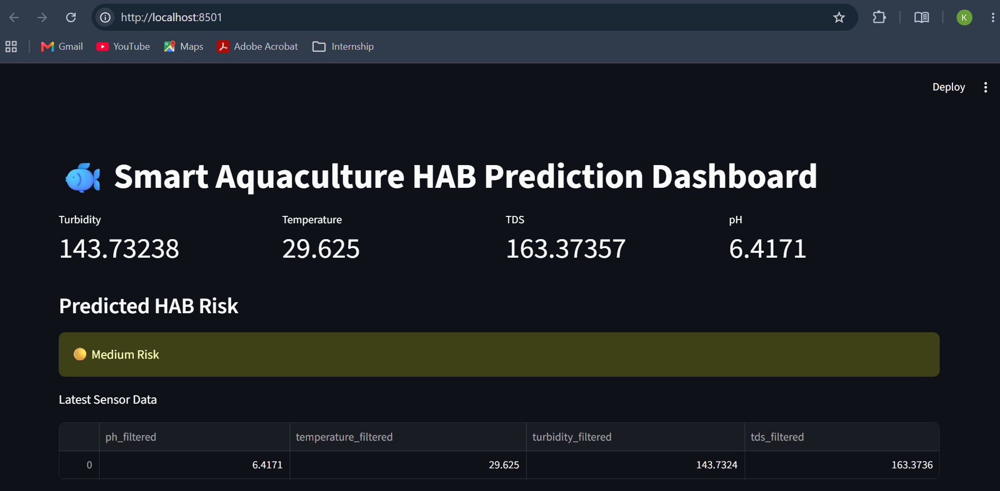
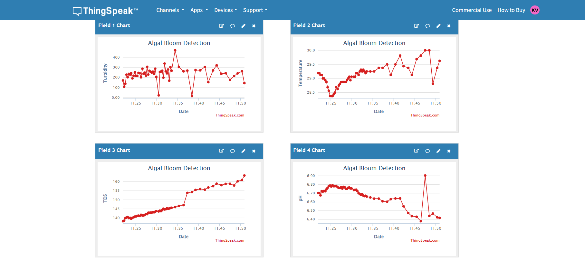
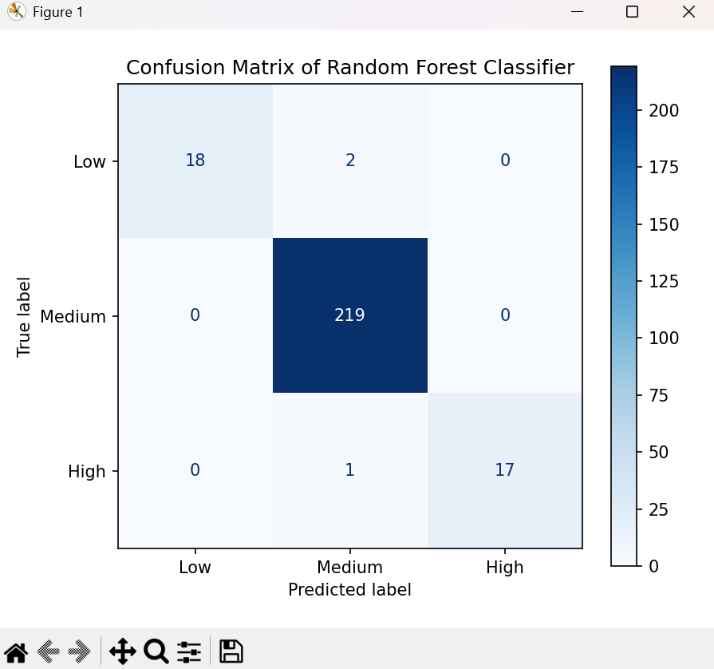

# 🐟 Smart Aquaculture HAB Risk Prediction System

An IoT and Machine Learning-based system for monitoring water quality and predicting Harmful Algal Bloom (HAB) risk in aquaculture environments.

## 🚀 Features

- Real-time water quality monitoring using ThingSpeak
- Kalman Filter-based sensor noise reduction
- Random Forest-based HAB risk prediction
- Interactive Streamlit dashboard
- Automated risk classification (Low, Medium, High)
- Historical data visualization

---

## 🔬 Parameters Monitored

- pH
- Temperature
- Turbidity
- Total Dissolved Solids (TDS)

---

## 🧠 Machine Learning Workflow

1. Data Preprocessing
2. Kalman Filtering
3. Feature Engineering
4. Risk Score Generation
5. Random Forest Classification
6. HAB Risk Prediction

---

## 🏗️ System Architecture

```text
Sensors
   │
   ▼
ThingSpeak Cloud
   │
   ▼
Data Processing
(Kalman Filter)
   │
   ▼
Random Forest Model
   │
   ▼
HAB Risk Prediction
   │
   ▼
Streamlit Dashboard
```

---

## 📊 Dashboard & Results

### Dashboard



### ThingSpeak Monitoring



### Model Evaluation



---

## 🛠️ Technologies Used

- Python
- Pandas
- NumPy
- Scikit-Learn
- Streamlit
- ThingSpeak
- Matplotlib
- Joblib

---

## 📂 Project Structure

```text
Smart-Aquaculture-HAB-Prediction/
│
├── app.py
├── train_model.py
├── hab_model.pkl
├── requirements.txt
├── README.md
│
└── screenshots/
    ├── dashboard.png
    ├── thingspeak.png
    └── confusion_matrix.png
```

---

## ⚙️ Installation

```bash
git clone https://github.com/kamala-git04/Algal-Bloom.git

cd Smart-Aquaculture-HAB-Prediction

pip install -r requirements.txt

streamlit run app.py
```

---

## 🔧 Configuration

Update your ThingSpeak credentials in `app.py`:

```python
CHANNEL_ID = "YOUR_CHANNEL_ID"
READ_API_KEY = "YOUR_READ_API_KEY"
```

---

## 📌 Dataset

The dataset used for model training is not included in this repository due to research and project constraints. 

---

## 👩‍💻 Author

**Kamala V**

B.Tech Information Technology

Interests: Machine Learning • Data Analytics • IoT • Full Stack Development

---

## 📜 License

This project is intended for educational and research purposes.
